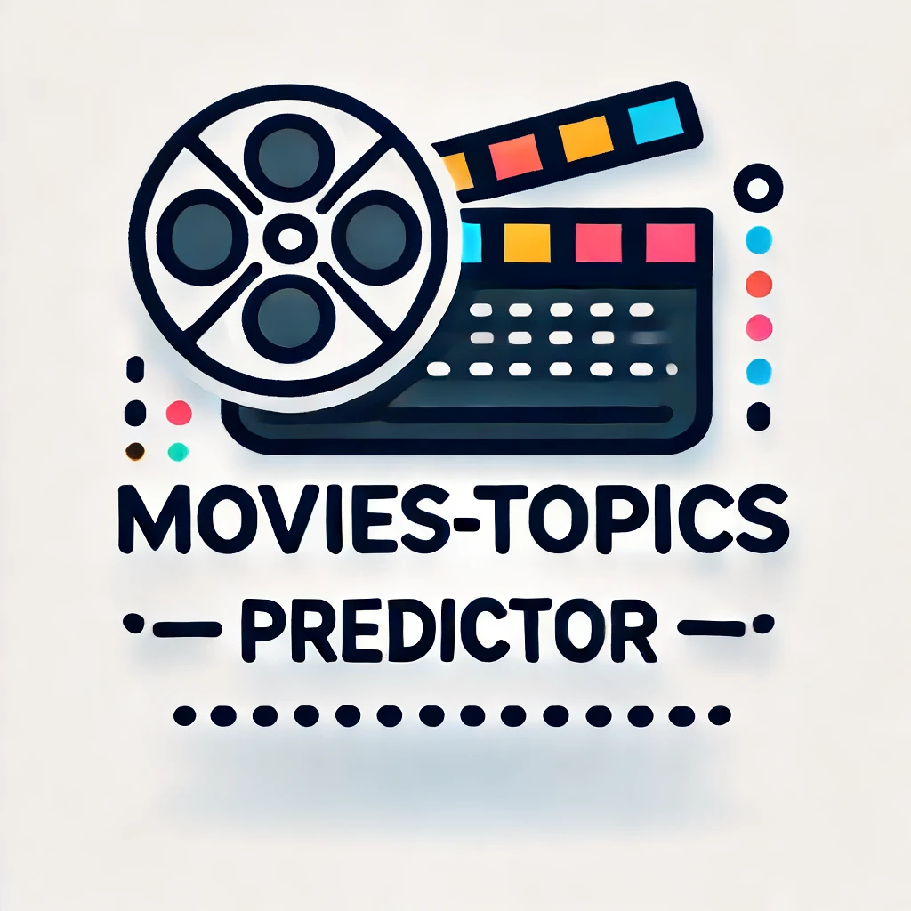
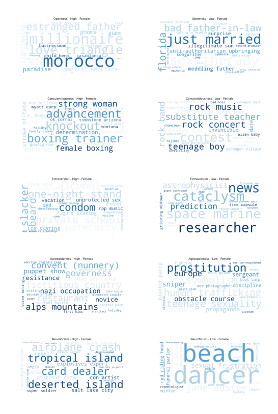

# OCEAN-Movie-Topics-Predictor

## Description
This framework project aims to analyze the relationship between movie keywords/topics and personality traits based on the Big Five model.   
   
The K-Nearest Neighbors (KNN) algorithm is used to predict which keywords or topics are associated with specific personality traits and gender by finding the most similar keywords for a trait. For each trait and gender combination, KNN identifies the 25 nearest keywords based on cosine similarity, calculates their similarity scores, and generates word clouds to visualize these associations. 

The features are from the Big Five OCEAN model (Openness, Conscientiousness, Extraversion, Agreeableness, and Neuroticism)

## Dataset
The MyPersonality dataset derived from a Facebook app comprises personality scores of user's that liked certain movies, along with demographic and profile data from users who consented to share their information for research (Approximately 1000 users). The dataset we have contains a list of about 850 movie titles facebook user's liked and their aggregated average measures of the users in terms of each personality trait, including age and gender (currently, data per user is not available).

## Sample Data

Below is a sample of the dataset, showing the aggregated Big Five personality traits:

| Movie          | OPE     | CON       | EXT       | AGR       | NEU     | Gender  | Keywords                                                                                                                                    |
|----------------|---------|-----------|-----------|-----------|---------|---------|----------------------------------------------------------------------------------------------------------------------------------------------|
| The Departed   | 0.3299  | -0.0998   | -0.0546   | -0.1404   | 0.2066  | 0.4096  | police, undercover, boston, massachusetts, gangster, irish-american, crime boss, friends, remake, mobster, organized crime, mafia, undercover cop, mole, state police, police training, realtor |
| The Green Mile | 0.2019  | -0.0425   | -0.0819   | -0.0265   | 0.056   | 0.6227  | mentally disabled, based on novel or book, southern usa, psychopath, death row, jail guard, supernatural, great depression, prison guard, jail, electric chair, torture, magic realism, healing, 1930s, abuse of power |
| The Lion King  | 0.2292  | -0.2175   | -0.1378   | 0.0373    | 0.0174  | 0.7268  | africa, lion, prince, redemption, musical, uncle, remake, grief, king, family, sidekick, live action and animation, father son relationship, live action remake                   |
| The Pianist    | 0.5071  | -0.1512   | -0.2516   | -0.1203   | -0.0028 | 0.6223  | concert, nazi, resistance, warsaw ghetto, polish resistance, homeland, holocaust (shoah), hunger, world war ii, prisoner of war, ghetto, deportation, jew persecution, liberation, biography, survival, based on memoir or autobiography, pianist, poland |

These scores represent the average personality trait levels and gender of users who liked each movie (Gender: 0 = male, 1 = female).

## Results

